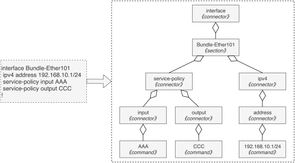
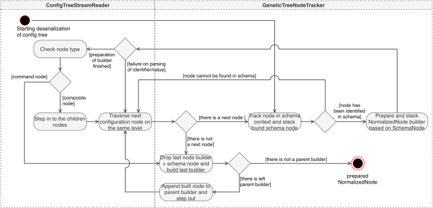
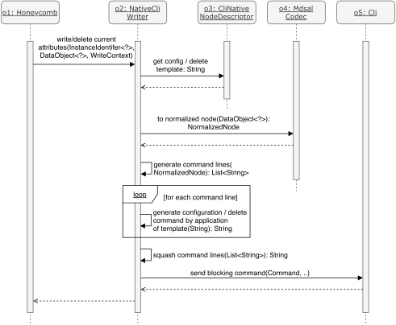
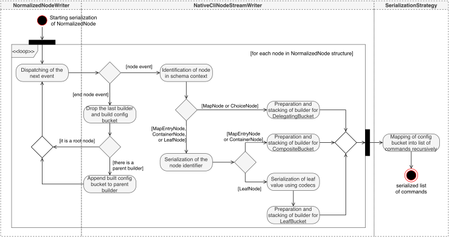

# UniConfig-native CLI

## Introduction

UniConfig-native CLI allows user configuration of CLI-enabled devices
using YANG models that describe configuration commands. In
UniConfig-native CLI deployment translation units are defined only by
YANG models and device-specific characteristics that are used for
parsing and serialization of commands. Afterwards, readers and writers
are automatically created and provided to translation registry - user
doesn't write them individually. YANG models can be constructed by
following of well-defined rules that are explained in Developer Guide.

Summarized characteristics of UniConfig-native CLI:

- modelling of device configuration using YANG models,
- automatic provisioning of readers and writers by generic translation
    unit,
- simple translation units per device type that must define
    device-characteristics and set of YANG models.

## Installation

CLI device can be installed as native-CLI device by adding
'uniconfig-config:uniconfig-native-enabled' flag with 'true' value into
the mount request (by default, this flag is set to 'false'). It is also
required to use tree parsing engine that is enabled by default. All
other mount request parameters that can be applied for classic CLI
mountpoints can also be used in native-CLI configuration with the same
meaning.

The following example shows how to mount Cisco IOS XR 5.3.4 device as
native-CLI device with enabled dry-run functionality:

```bash
curl --location --request POST 'http://localhost:8181/rests/operations/connection-manager:install-node' \
--header 'Authorization: Basic YWRtaW46YWRtaW4=' \
--header 'Content-Type: application/json' \
--data-raw '{
    "input": {
        "node-id": "iosxr",
        "cli": {
            "cli-topology:host": "192.168.1.214",
            "cli-topology:port": "22",
            "cli-topology:transport-type": "ssh",
            "cli-topology:device-type": "ios xr",
            "cli-topology:device-version": "5.3.4",
            "cli-topology:username": "cisco",
            "cli-topology:password": "cisco",
            "cli-topology:journal-size": 150,
            "cli-topology:dry-run-journal-size": 150,
            "cli-topology:parsing-engine": "batch-parser",
            "node-extension:reconcile": false,
            "uniconfig-config:install-uniconfig-node-enabled": false,
            "uniconfig-config:uniconfig-native-enabled": true
        }
    }
}'
```

After mounting of CLI node finishes, you can verify CLI mountpoint by
fetching its Operational datastore:

```bash
curl --location --request GET 'http://127.0.0.1:8181/rests/data/network-topology:network-topology/topology=cli/node=iosxr?content=nonconfig'
```

You can see that there are some native models included in the
'available-capabilities' plus basic mandatory capabilities for CLI
mountpoints. Number of supported native capabilities depends on number
of written models that are included in native-CLI translation unit for
IOS XR 5.3.4, in this case. The only common capability for all
native-CLI mountpoints is
'<http://frinx.io/yang/native/extensions?module=cli-native-extensions>'.
Sample list of native capabilities:

```
"http://frinx.io/yang/native/xr5/interface?module=xr5-interfaces-clinative&amp;revision=2020-03-12",
"http://frinx.io/yang/native/extensions?module=cli-native-extensions&amp;revision=2020-03-09",
"http://frinx.io/yang/native/xr5/template?module=xr5-template&amp;revision=2020-04-20",
"http://frinx.io/yang/native/xr5/acl?module=xr5-acl-clinative&amp;revision=2020-03-10"
```

The synced configuration on UniConfig layer can be verified in the same
way as for all types of devices:

```bash
curl --request GET 'http://127.0.0.1:8181/rests/data/network-topology:network-topology/topology=uniconfig/node=iosxr/frinx-uniconfig-topology:configuration?content=config'
```

Since sample device configuration contains both ACL and interface
configuration and native-CLI IOS XR 5.\* covers this configuration, the
synced data looks like the next output:

```
{
    "frinx-uniconfig-topology:configuration": {
        "xr5-acl-clinative:ipv4": {
            "access-list": [
                {
                    "name": "ACL02",
                    "sequence-number": 30,
                    "permit": "ipv4 any any"
                },
                {
                    "name": "ACL01",
                    "sequence-number": 30,
                    "permit": "eigrp any any"
                },
                {
                    "name": "ACL02",
                    "sequence-number": 20,
                    "deny": "icmp 172.16.1.0/24 172.16.2.0/24 echo"
                },
                {
                    "name": "ACL01",
                    "sequence-number": 20,
                    "permit": "ospf any any"
                },
                {
                    "name": "ACL01",
                    "sequence-number": 40,
                    "deny": "ipv4 host 1.1.1.1 any log"
                },
                {
                    "name": "ACL02",
                    "sequence-number": 10,
                    "deny": "esp 10.0.0.0/8 any icmp-off"
                },
                {
                    "name": "ACL01",
                    "sequence-number": 10,
                    "permit": "tcp 192.168.10.0 0.0.0.255 192.168.20.0 0.0.0.255 range 1 1024"
                }
            ]
        },
        "xr5-acl-clinative:ipv6": {
            "access-list": [
                {
                    "name": "ACL6-01",
                    "sequence-number": 40,
                    "permit": "ipv6 any any"
                },
                {
                    "name": "ACL6-01",
                    "sequence-number": 10,
                    "remark": "This is just a test"
                },
                {
                    "name": "ACL6-01",
                    "sequence-number": 20,
                    "permit": "tcp fe10::10/64 eq 1451 any syn"
                },
                {
                    "name": "ACL6-01",
                    "sequence-number": 30,
                    "deny": "ospf fe20::20/64 host fe10::101"
                }
            ]
        },
        "xr5-interfaces-clinative:interface": [
            {
                "name": "MgmtEth0/0/CPU0/0",
                "ipv4": {
                    "address": "192.168.1.214 255.255.255.0"
                }
            },
            {
                "name": "GigabitEthernet0/0/0/2"
            },
            {
                "name": "GigabitEthernet0/0/0/0",
                "shutdown": [
                    null
                ]
            },
            {
                "name": "GigabitEthernet0/0/0/1"
            }
        ]
    }
}
```

The previous sample output corresponds to the following parts of the
configuration on the device:

```bash
ipv6 access-list ACL6-01
 10 remark "This is just a test"
 20 permit tcp fe10::10/64 eq 1451 any syn
 30 deny ospf fe20::20/64 host fe10::101
 40 permit ipv6 any any
!
ipv4 access-list ACL01
 10 permit tcp 192.168.10.0 0.0.0.255 192.168.20.0 0.0.0.255 range 1 1024
 20 permit ospf any any
 30 permit eigrp any any
 40 deny ipv4 host 1.1.1.1 any log
!
ipv4 access-list ACL02
 10 deny esp 10.0.0.0/8 any icmp-off
 20 deny icmp 172.16.1.0/24 172.16.2.0/24 echo
 30 permit ipv4 any any
!
interface MgmtEth0/0/CPU0/0
 ipv4 address 192.168.1.214 255.255.255.0
!
interface GigabitEthernet0/0/0/0
 shutdown
!
interface GigabitEthernet0/0/0/1
!
interface GigabitEthernet0/0/0/2
!
```

## Architecture

The following section describes building blocks and automated processes
that take place in UniConfig-native CLI.

### Modules

The following UML diagram shows dependencies between modules from which
UniConfig native-cli is built. The core of the system is represented by
'native-cli-unit' module in CLI layer that depends on CLI API for
registration of units and readers and writers API. On the other side
there are CLI-units that extend 'GenericCliNativeUnit'.


Description of modules:

- **utils-unit and translation-registry-api/spi**: CLI layer API which
    native-cli units depend on. It defines interface for CLI
    readers/writers, translation unit collector that can be used for
    registration of native-CLI unit, and common 'TranslateUnit'
    interface.
- **native-cli-unit**: It is responsible for automatic provisioning
    and registration of readers and writers (handlers) based on YANG
    modules that are defined in specific translation units. Readers and
    writers are initialized only for root container and list schema
    nodes defined in YANG models. All specific native-CLI units must be
    derived from abstract class 'GenericCliNativeUnit'.
- **ios-xr-5-native and junos-17-native**: Specific native-CLI units
    derived from 'GenericCliNativeUnit'. To make native-CLI unit
    working, it must implement methods that provides list of YANG
    modules, list of root data object interface, supported device
    versions, unit name, and CLI flavour.

### Registration of handlers

Registration of native-CLI handlers is described by following sequence
diagram in detail.


Description of the process:

1.  **Searching for root schema node**: Extraction of the root list and
    container schema nodes from nodes that are augmented to UniConfig
    topology.
2.  **Building of device template information**: Extraction of device
    template information from imported template YANG modules. This
    template contains command used for displaying of whole device
    configuration, format of configuration command, and format of delete
    command.
3.  **Initialization of handlers**: Creation of native-CLI config
    readers and writers or native-CLI list readers and writers in case
    of list schema nodes.
4.  **Registration of handlers**: Registration of readers and writers in
    reader and writer registries. Readers are registered as generic
    config readers, whereas writers are registered as wildcarded subtree
    writers.

!!!
Since native-CLI readers are not registered as subtree readers, it is
possible to directly read only root elements from CLI mountpoint. This
constraint is caused by unsupported wildcarded subtree readers in
Honeycomb framework.
!!!

### Functionality of readers

Config readers and config list readers in UniConfig-native CLI are
implemented as generic readers that parse device configuration into
structuralized format based on registered native-CLI YANG models. These
readers are initialized and registered per root data schema node that is
supported in native-CLI. The next sequence diagram shows process taken
by generic reader on calling 'readCurrentAttributes(..)' method.


Description of the process:

1. **Creation of the configuration tree**: It represents current device
    configuration by sending of 'show' command which is responsible for
    displaying of whole device configuration.
2. **Transformation of configuration tree**: It is transformed into
    binding-independent NormalizedNode using 'ConfigTreeStreamReader'
    component.
3. **Conversion into binding-aware format**: Conversion of
    binding-independent NormalizedNode into binding-aware DataObject and
    population of DataObject builder by fields from built DataObject.

Configuration is parsed into structuralized form before it is actually
transformed into NormalizedNodes (step 1) because of more modular and
easier approach. Configuration tree consists of 3 types of nodes:

a. **Command nodes**: They are represented by the last identifiers of
    the commands (command word). These nodes don't have any children
    nodes.
b. **Section nodes**: These nodes are represented by the command word /
    identifier that opens a new configuration section. Section nodes can
    have multiple children nodes.
c. **Connector nodes**: Connector nodes are similar to section nodes
    with identifier and multiple possible children nodes. However, they
    don't open a new configuration section; they represent just one
    intermediary word in command line.

Example - parsing of interface commands into the tree structure:



Detailed description of algorithm for transformation of configuration
tree into DOM objects:



!!!
If some commands are not covered by native-CLI YANG models, the
parsing of configuration in readers will not fail - unsupported nodes
will be skipped.
!!!

### Functionality of writers

Config writers and config list writers are responsible for serialization
of structuralized data from datastore into series of configuration or
delete command lines that are compatible with target device. Native CLI
writers are also registered only for root schema nodes on the same paths
as readers. The next sequence diagram shows process taken by generic
writer on calling 'writeCurrentAttributes(..)' or
'deleteCurrentAttributes(..)' method.



Description of the process:

1. **Conversion into binding-independent format**: Conversion of
    binding-aware DataObject into binding-independent NormalizedNode
    format. Binding-independent format is more suited for automated
    traversal and building when the target class types of nodes are not
    known before compilation of YANG schemas is done.
2. **Generation of command lines**: NormalizedNode is serialized using
    stream writer into configuration buckets that are afterwards
    serialized into separated command lines. Conversion of configuration
    buckets into command lines can be customized by different
    strategies. Currently only the primitive strategy is used - it
    creates for each leaf command argument the full command line from
    top root - nesting into configuration modes is not supported. This
    step is described in detail by next activity diagram.
3. **Generation of configuration or delete command lines**: It is done
    by application of configuration or delete template on command line -
    for example, JUNOS devices use prefix 'set' for applying of the
    configuration and prefix 'delete' for removal of configuration from
    device.
4. **Squashing of command lines into single snippet**: This is only
    optimization step - all command lines are joined together with
    newline separator.
5. **Sending of command to the device** (blocking operation).

Configuration buckets are created as intermediary step because of the
modularity and flexibility for application of different serialization
strategies in future. There are 3 types of created buckets that are
wired with respective schema nodes:

a. **Leaf bucket**: Bucket that doesn't have any children but it has a
    value in addition to the identifier. It is created from LeafNode.
b. **Composite bucket**: Bucket with identifier and possibly multiple
    children buckets. It can be used for following types of DOM nodes:
    ContainerNode or MapEntryNode.
c. **Delegating bucket**: Bucket that doesn't have any identifier, it
    just delegates configuration to its children buckets. It can be used
    for nodes that are described by ChoiceNode or MapNode.



!!!
The current implementation processes updates in default way - the
whole actual configuration is removed and then the whole updated
configuration is written back to device. This strategy can cause slow
down of the commit operation in case of longer configuration and
because of this reason it is addressed as one of the future
improvements.
!!!
