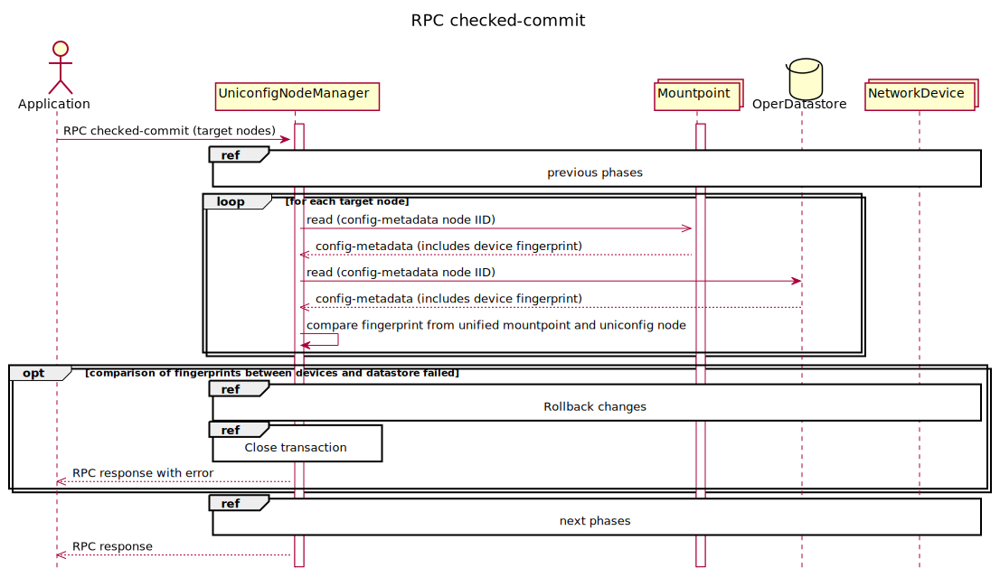

# RPC checked-commit

The checked-commit RPC is the trigger for executing the checked configuration.

A checked commit is similar to an RPC commit, but it also checks that nodes are in sync with the network before it starts configuration. The RPC fails if any node is out of sync.

RPC output describes the result of the commit and matches all modified nodes in the UniConfig transaction. If a node fails for any reason, the entire RPC fails.

Compared to the commit RPC, there is an additional step between steps 1 and 3:

1. Lock and validate configured nodes
2. Check if nodes are in sync with state on devices
3. Write configuration to device
4. Validate configuration
5. Confirmed commit
6. Confirming commit (submit configuration)

The following diagram illustrates the check assuming that configuration fingerprints in the transaction datastore and device are equal.



!!!
Fingerprint-based validation is different between steps 1 and 2. For step 1, the goal is to validate if another transaction has already changed the same node by comparing fingerprints in the UniConfig transaction and the database. Step 2 checks that the fingerprint in the transaction is equal to the fingerprint on the device (i.e., if another system or a user directly via the CLI has updated the device configuration since the beginning of the transaction).
!!!

## RPC examples

### Successful example

The configuration of nodes R1 and R2 has been modified in the transaction. Both nodes are in sync with the actual state on the device.

RPC input invokes all touched nodes.

```bash RPC Request
curl --location --request POST 'http://localhost:8181/rests/operations/uniconfig-manager:checked-commit' \
--header 'Accept: application/json' \
--header 'Content-Type: application/json' \
--data-raw '{
    "input": {
    }
}'
```

```RPC Response, Status: 204
```

### Failed example

The configuration of nodes R1 and R2 has been modified in the transaction. Both R1 and R2 are in sync with the actual state on the device. Node R1 has failed due to incorrect configuration.

RPC output describes the result of the checked-commit RPC.

```bash RPC Request
curl --location --request POST 'http://localhost:8181/rests/operations/uniconfig-manager:checked-commit' \
--header 'Accept: application/json' \
--header 'Content-Type: application/json' \
--data-raw '{
    "input": {
    }
}'
```

```json RPC Response, Status: 500
{
  "errors": {
    "error": [
      {
        "error-type": "application",
        "error-tag": "operation-failed",
        "error-message": "Supplied value \"GigabitEthernet0/0/0/1ghjfhjfhjfghj\" does not match required pattern \"^(([a-zA-Z0-9_]*\\d+/){3,4}\\d+)|(([a-zA-Z0-9_]*\\d+/){3,4}\\d+\\.\\d+)|(([a-zA-Z0-9_]*\\d+/){2}([a-zA-Z0-9_]*\\d+))|(([a-zA-Z0-9_]*\\d+/){2}([a-zA-Z0-9_]+))|([a-zA-Z0-9_-]*\\d+)|([a-zA-Z0-9_-]*\\d+\\.\\d+)|(mpls)|(dwdm)$\"\n",
        "error-info": {
          "node-id": "R1",
          "configuration-status": "fail",
          "rollback-status": "complete"
        }
      }
    ]
  }
}
```

### Failed example

The configuration of node R1 has been changed in the transaction. Node R1 is in sync with the actual state on the device. Node R1 has failed on the changed fingerprint.

RPC output describes the result of the checked-commit.

```bash RPC Request
curl --location --request POST 'http://localhost:8181/rests/operations/uniconfig-manager:checked-commit' \
--header 'Accept: application/json' \
--header 'Content-Type: application/json' \
--data-raw '{
    "input": {
    }
}'
```

```json RPC Response, Status: 500
{
  "errors": {
    "error": [
      {
        "error-type": "application",
        "error-tag": "validation-failed",
        "error-message": "Fingerprint from datastore: 2019-09-04T09:32:41 is different than fingerprint from device: 2019-09-04T09:49:01",
        "error-info": {
          "node-id": "R1",
          "configuration-status": "fail"
        }
      }
    ]
  }
}
```

### Failed example

Node R2 has lost connection.

```bash RPC Request
curl --location --request POST 'http://localhost:8181/rests/operations/uniconfig-manager:checked-commit' \
--header 'Accept: application/json' \
--header 'Content-Type: application/json' \
--data-raw '{
    "input": {
    }
}'
```

```json RPC Response, Status: 502
{
  "errors": {
    "error": [
      {
        "error-type": "application",
        "error-tag": "southbound_no_connection",
        "error-message": "Unified Mountpoint not found.",
        "error-info": {
          "node-id": "R2",
          "configuration-status": "fail"
        }
      }
    ]
  }
}
```

### Failed example

If the RPC input does not contain target nodes and no nodes have been touched, the request results in an error.

```bash RPC Request
curl --location --request POST 'http://localhost:8181/rests/operations/uniconfig-manager:checked-commit' \
--header 'Accept: application/json' \
--header 'Content-Type: application/json' \
--data-raw '{
    "input": {
    }
}'
```

```json RPC Response, Status: 400
{
  "errors": {
    "error": [
      {
        "error-type": "application",
        "error-tag": "missing-element",
        "error-message": "There aren't any touched nodes."
      }
    ]
  }
}
```
