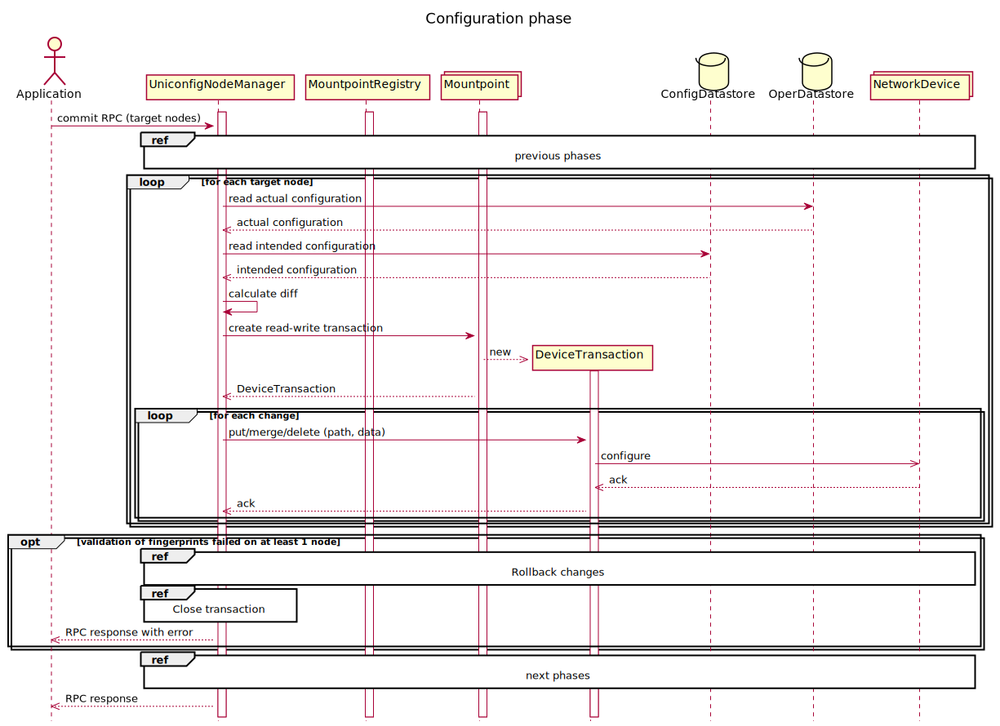
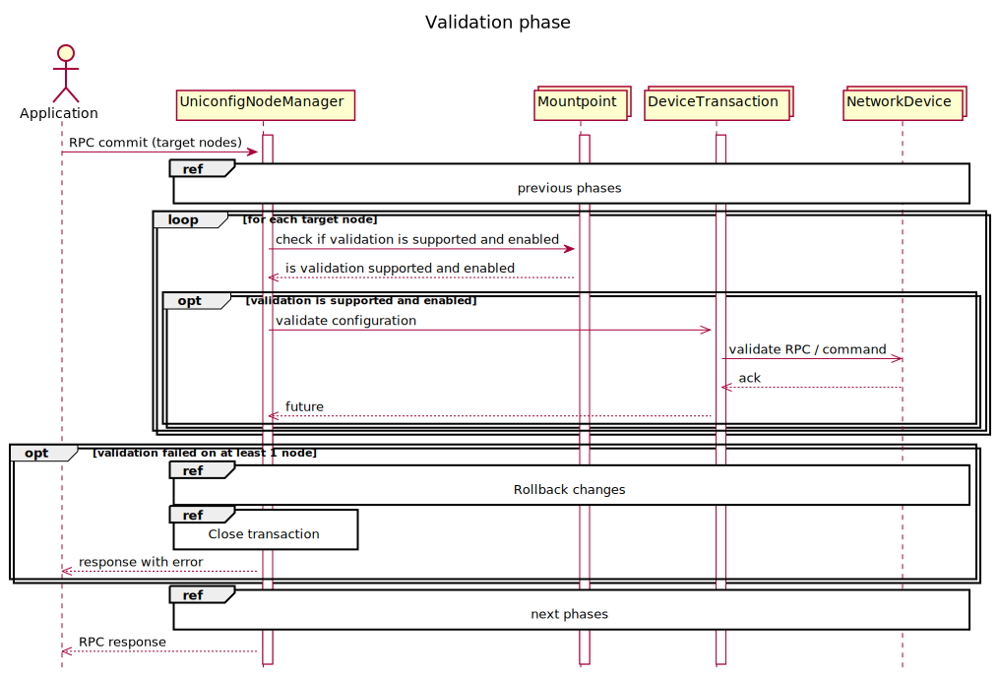

# RPC commit

The external application stores the intended configuration under nodes
in the UniConfig topology. The trigger for execution of configuration
is an RPC commit. Output of the RPC describes the result of the commit.

The configuration of nodes consists of the following phases:

1. Lock and validate configured nodes - Locking all modified nodes
    using PostgreSQL advisory locks and validation of fingerprints - if
    another transaction tries to commit overlapping nodes or different
    transaction has already changed one of the nodes, then commit will
    fail at this step.
2. Write configuration into device - Pushing calculated changes into
    device without committing of these changes.
3. Validate configuration - Validation of written configuration from
    the view of constraints and consistency.
    This phase can be skipped with "do-validate" flag.
4. Confirmed commit - It is used for locking of device configuration,
    so no other transaction can touch this device. This phase can be
    skipped with "do-confirmed-commit" flag.
5. Confirming commit (submit configuration) - Persisting all changes
    on devices and in the PostgreSQL database. UniConfig transaction
    is closed.
6. Rollback - It is used for restoring of configuration to previous
    state, if the configuration process fails. When configuring more
    devices in a single transaction and the process fails on one
    particular device, the rollback procedure will be applied to all
    touched devices. This is done by auto rollback procedure, which
    is by default turned on. It can be switched off by setting up
    'do-rollback' flag in input of Commit RPC request. Then only
    failed devices will be rollbacked. 

!!!
The 'skip-unreachable-nodes' flag controls whether unreachable nodes
are skipped when the RPC commit is sent. If set to 'true', nodes that
are not reachable are skipped and others are configured. The default
value is 'false'.
!!!


Commit invoke all touched nodes in transaction. There are no target
nodes in the RPC input.

The third and fourth phases take place only on the nodes that support
these operations. If one node failed in the random phase for any reason
the RPC will fail entirely. After commit RPC, UniConfig transaction is
closed regardless of the commit result.

!!!
If one of the nodes uses a confirmed commit (phase 4), which does not
fail, then it is necessary to issue the submitted configuration (phase 5)
within the timeout period. Otherwise, the node configuration issued by
the confirmed commit will be reverted to its state before the confirmed
commit (i.e. confirmed commit makes only temporary configuration changes).
The timeout period is 600 seconds (10 minutes) by default, but the user
can change it in the installation request.
!!!

Next diagram describe the first phase of commit RPC - locking of changes
nodes in the PostgreSQL database and verification if other transaction
has already committed overlapping nodes.

Next diagrams describe all 5 commit phases in detail:

**1. Lock and validate configured nodes**


**2. Write configuration into device**



**3. Validate configuration**



**4. Confirmed commit**


**5. Confirming commit (submit configuration)**


The last diagram shows rollback procedure that must be executed after
failed commit on nodes that have already been configured and don't
support 'candidate' datastore.


## RPC Examples

### Successful Example

UniConfig commits nodes 'R1' and 'R2' that has been changed in
the actual transaction.

```bash RPC Request
curl --location --request POST 'http://localhost:8181/rests/operations/uniconfig-manager:commit' \
--header 'Accept: application/json' \
--header 'Content-Type: application/json' \
--data-raw '{
    "input": {
    }
}'
```

```RPC Response, Status: 200
```

### Successful Example

Nodes 'R1' and 'R2' has been changed. RPC commit input has the flag
to disable confirmed-commit phase. UniConfig commits all touched nodes.

```bash RPC Request
curl --location --request POST 'http://localhost:8181/rests/operations/uniconfig-manager:commit' \
--header 'Accept: application/json' \
--header 'Content-Type: application/json' \
--data-raw '{
    "input": {
        "do-confirmed-commit": false,
    }
}'
```

```RPC Response, Status: 200
```

### Successful Example

If there are not any touched nodes, the request will finish successfully.

```bash RPC Request
curl --location --request POST 'http://localhost:8181/rests/operations/uniconfig-manager:commit' \
--header 'Accept: application/json' \
--header 'Content-Type: application/json' \
--data-raw '{
    "input": {
    }
}'
```

```RPC Response, Status: 200
```

### Failed Example

Node 'R1' has failed because of failed validation phase.

```bash RPC Request
curl --location --request POST 'http://localhost:8181/rests/operations/uniconfig-manager:commit' \
--header 'Accept: application/json' \
--header 'Content-Type: application/json' \
--data-raw '{
    "input": {
    }
}'
```

```json RPC Response, Status: 500
{
  "output": {
    "node-result": [
      {
        "error-type": "application",
        "error-tag": "validation-failed",
        "error-message": "RemoteDevice{R2}: Validate failed. illegal reference /orgs/org[name='TESTING-PROVIDER']/traffic-identification/using-networks",
        "error-info": {
          "node-id": "R2",
          "configuration-status": "fail",
          "rollback-status": "complete"
        }
      }
    ]
  }
}
```

### Failed Example

Node 'R1' has failed because the confirmed commit failed. Validation
phase was skipped due to false "do-validate" flag.

```bash RPC Request
curl --location --request POST 'http://localhost:8181/rests/operations/uniconfig-manager:commit' \
--header 'Accept: application/json' \
--header 'Content-Type: application/json' \
--data-raw '{
    "input": {
        "do-validate" : False,
    }
}'
```

```json RPC Response, Status: 500
{
  "errors": {
    "error": [
      {
        "error-type": "application",
        "error-tag": "operation-failed",
        "error-message": "RemoteDevice{R1}: Confirmed commit failed. illegal reference /orgs/org[name='TESTING-PROVIDER']/traffic-identification/using-networks",
        "error-info": {
          "node-id": "R1",
          "configuration-status": "fail",
          "rollback-status": "complete"
        }
      }
    ]
  }
}
```

### Failed Example

Node 'R1' has failed because of the time delay between the confirmed
commit and the submitted configuration.

```bash RPC Request
curl --location --request POST 'http://localhost:8181/rests/operations/uniconfig-manager:commit' \
--header 'Accept: application/json' \
--header 'Content-Type: application/json' \
--data-raw '{
    "input": {
    }
}'
```

```json RPC Response, Status: 500
{
  "errors": {
    "error": [
      {
        "error-type": "application",
        "error-tag": "operation-failed",
        "error-message": "RemoteDevice{R1}: time delay between confirmed and confirming commit was greater than 300 seconds, the configured changes were rolled back.",
        "error-info": {
          "node-id": "R1",
          "configuration-status": "fail",
          "rollback-status": "complete"
        }
      }
    ]
  }
}
```

### Failed Example

Node 'R1' has failed due to improper configuration.

```bash RPC Request
curl --location --request POST 'http://localhost:8181/rests/operations/uniconfig-manager:commit' \
--header 'Accept: application/json' \
--header 'Content-Type: application/json' \
--data-raw '{
    "input": {
    }
}'
```

```json RPC Response, Status: 500
{
  "errors": {
    "error": [
      {
        "error-type": "application",
        "error-tag": "operation-failed",
        "error-message": "Supplied value \"GigabitEthernet0/0/0/1ghjfhjfhjfghj\" does not match required pattern \"^(([a-zA-Z0-9_]*\\d+/){3,4}\\d+)|(([a-zA-Z0-9_]*\\d+/){3,4}\\d+\\.\\d+)|(([a-zA-Z0-9_]*\\d+/){2}([a-zA-Z0-9_]*\\d+))|(([a-zA-Z0-9_]*\\d+/){2}([a-zA-Z0-9_]+))|([a-zA-Z0-9_-]*\\d+)|([a-zA-Z0-9_-]*\\d+\\.\\d+)|(mpls)|(dwdm)$\"",
        "error-info": {
          "node-id": "R1",
          "configuration-status": "fail",
          "rollback-status": "complete"
        }
      }
    ]
  }
}
```

### Failed Example

Node 'R1' has lost connection.

```bash RPC Request
curl --location --request POST 'http://localhost:8181/rests/operations/uniconfig-manager:commit' \
--header 'Accept: application/json' \
--header 'Content-Type: application/json' \
--data-raw '{
    "input": {
    }
}'
```

```json RPC Response, Status: 502
{
  "errors": {
    "error": [
      {
        "error-type": "application",
        "error-tag": "southbound_no_connection",
        "error-message": "Unified Mountpoint not found.",
        "error-info": {
          "node-id": "R1",
          "configuration-status": "fail"
        }
      }
    ]
  }
}
```

### Failed Example

Node 'R1' has failed because of wrong configuration. In this case
validation, confirm-commit and auto-rollback were switched off. 
Because auto-rollback is switched off, configuration of 'R1' device
was successful. However, this can be done only if validation and
confirm-commit phase were successful or skipped, otherwise configuration
of 'R1' device would also fail.

```bash RPC Request
curl --location --request POST 'http://localhost:8181/rests/operations/uniconfig-manager:commit' \
--header 'Accept: application/json' \
--header 'Content-Type: application/json' \
--data-raw '{
    "input": {
        "do-rollback" : false,
        "do-validate" : false,
        "do-confirmed-commit" : false
    }
}'
```

```json RPC Response, Status: 500
{
  "errors": {
    "error": [
      {
        "error-type": "application",
        "error-tag": "operation-failed",
        "error-message": "RemoteDevice{vnf212}: RPC during tx failed. Error messages: [/alias[name='^new']/expansion is not configured]",
        "error-info": {
          "node-id": "R1",
          "configuration-status": "fail"
        }
      }
    ]
  }
}
```

### Failed Example

Configuration of nodes 'R1' nad 'R2' has been changed in the transaction
and both are in-sync with actual state on the device. Then connection of
node 'R2' has been lost. RPC commit input has the flag to skip unreachable
nodes set to true. Result of the commit RPC describes success of 'R1' node
and shows list of unreachable nodes.

```bash RPC Request
curl --location --request POST 'http://localhost:8181/rests/operations/uniconfig-manager:commit' \
--header 'Accept: application/json' \
--header 'Content-Type: application/json' \
--data-raw '{
    "input": {
        "skip-unreachable-nodes": true
    }
}'
```

```json RPC Response, Status: 200
{
  "output": {
    "unreachable-nodes": [
      "R2"
    ]
  }
}
```
