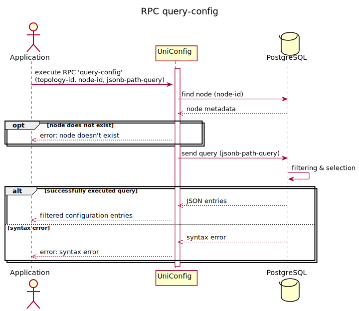

# UniConfig Queries

This module is responsible for execution of queries on the configuration of some device, template, UniStore node,
or snapshot.

## RPC query-config

UniConfig exposes filtering and selection API using RPC 'query-config'. Filtering and selection of configuration
is done only on the database side - UniConfig receives already narrowed configuration with only selected data.
Since query is evaluated by the database, this feature is works only with already committed data (operational data).

The following sequence diagram captures the whole process of RPC execution in detail.



### RPC input fields

- **topology-id**: Identifier of network-topology/topology list entry. Currently, supported topologies, under which
  this RPC can be used, are: 'uniconfig', 'templates', 'unistore', and snapshot topologies.
- **node-id**: Identifier of specific network-topology/node list entry which configuration is filtered using specified
  jsonb-path-query.
- **jsonb-path-query**: JSONB-path query used for selection and filtering of subtrees in the node configuration stored
  in the PostgreSQL. JSONB-path must start from root "frinx-uniconfig-topology:configuration" container
  (it is always represented by absolute path).

!!!
JSONB-path query syntax is specified by PostgreSQL. You can find detailed description of all features with examples
on the following link (version 14):
https://www.postgresql.org/docs/14/functions-json.html#FUNCTIONS-SQLJSON-PATH
!!!

### RPC output fields

- **config**: List of selected and filtered JSON objects. Note that database may return multiple list entries,
  if the last element in the JSONB-path is represented by list/leaf-list YANG schema node. In other cases, only
  one or no JSON object is displayed on output based on fulfilling the filtering and selection criteria.

### Example: selection of JSON object

The following request demonstrated execution of simple selection query under the 'dev01' from 'uniconfig' topology.
Response contains 1 JSON object - 'ssh' container.

```bash RPC Request
curl --location --request POST 'http://127.0.0.1:8181/rests/operations/uniconfig-query:query-config' \
--header 'Accept: application/json' \
--header 'Content-Type: application/json' \
--data-raw '{
    "input": {
        "node-id": "dev01",
        "topology-id": "uniconfig",
        "jsonb-path-query": "$.\"frinx-uniconfig-topology:configuration\"
        .\"system\"
        .\"ssh\""
    }
}'
```

```json RPC Response, Status: 200
{
    "output": {
        "config": [
            {
                "keepalive-interval": 300,
                "max-retries": 0
            }
        ]
    }
}
```

!!!
JSONB-path query should always start with $.\"frinx-uniconfig-topology:configuration\" pattern because 'configuration'
represents wrapping element for all root data elements that are stored in database.
!!!

!!!
Be aware that PostgreSQL requires escaping of special characters in the identifiers of JSON elements. For example,
':' and '-' represents special characters. Because of this behaviour, it is always safer to put double quotes around
all identifiers as it is done in this example.
!!!

### Example: filtering list of JSON objects

The next query demonstrates filtering of 'address' JSON objects using predicate based on 'ipv4-address'
(the first octet must have a value '80'). Addresses under all 'controller' list entries are filtered.
In this example, response contains multiple JSON objects representing 'address' list entries.

```bash RPC Request
curl --location --request POST 'http://127.0.0.1:8181/rests/operations/uniconfig-query:query-config' \
--header 'Accept: application/json' \
--header 'Content-Type: application/json' \
--data-raw '{
    "input": {
        "node-id": "dev01",
        "topology-id": "uniconfig",
        "jsonb-path-query": "$.\"frinx-uniconfig-topology:configuration\"
            .\"system\"
            .\"wan-connections\"
            .\"endpoints\"
            .\"controller\"[*]
            .\"addresses\"
            .\"address\"[*] ? (@.\"ipv4-address\" like_regex \"80\\..*\")"
    }
}'
```

```json RPC Response, Status: 200
{
    "output": {
        "config": [
            {
                "name": "TestController1",
                "ipv4-address": "80.80.1.2",
                "domains": [
                    "Internet"
                ]
            },
            {
                "name": "TestController2",
                "ipv4-address": "80.80.2.2",
                "domains": [
                    "Internet"
                ]
            }
        ]
    }
}
```

### Example: selection of leaf-list content

The next request shows selection of all addresses under ethernet interfaces with type 'vxlan' and 'enabled' flag
set to 'true'. Response will contain aggregated array of strings, because 'address' is represented by leaf-list.

```bash RPC Request
curl --location --request POST 'http://127.0.0.1:8181/rests/operations/uniconfig-query:query-config' \
--header 'Accept: application/json' \
--header 'Content-Type: application/json' \
--data-raw '{
    "input": {
        "node-id": "dev01",
        "topology-id": "uniconfig",
        "jsonb-path-query": "$.\"frinx-uniconfig-topology:configuration\"
            .\"interfaces:interfaces\"
            .\"ethernet\"[*] ? (@.\"type\" == \"vxlan\")
            .\"family\"[*] ? (@.\"enabled\" == true)
            .\"address\""
    }
}'
```

```json RPC Response, Status: 200
{
    "output": {
        "config": [
            "10.1.0.105/32",
            "10.2.0.105/32",
            "10.3.0.105/32",
            "10.4.0.105/32"
        ]
    }
}
```

### Example: non-existing node

If node with specified identifier doesn't exist under target topology, RPC will return 400 with corresponding
error message.

```bash RPC Request
curl --location --request POST 'http://127.0.0.1:8181/rests/operations/uniconfig-query:query-config' \
--header 'Accept: application/json' \
--header 'Content-Type: application/json' \
--data-raw '{
    "input": {
        "node-id": "test",
        "topology-id": "uniconfig",
        "jsonb-path-query": "$.\"frinx-uniconfig-topology:configuration\"
            .\"interfaces:interfaces\""
    }
}'
```

```json RPC Response, Status: 400
{
    "errors": {
        "error": [
            {
                "error-type": "application",
                "error-message": "Node with ID 'test' doesn't exist in the topology 'uniconfig'",
                "error-tag": "invalid-value",
                "error-info": "<severity>error</severity>"
            }
        ]
    }
}
```

### Example: syntax error

In case of invalid forma of input 'jsonb-path-query', UniConfig will return 400 status code with error-message
describing syntax error.

```bash RPC Request
curl --location --request POST 'http://127.0.0.1:8181/rests/operations/uniconfig-query:query-config' \
--header 'Accept: application/json' \
--header 'Content-Type: application/json' \
--data-raw '{
    "input": {
        "node-id": "dev01",
        "topology-id": "uniconfig",
        "jsonb-path-query": "$.\"frinx-uniconfig-topology:configuration\"
            .\"interfaces:interfaces\"
            ."
    }
}'
```

```json RPC Response, Status: 400
{
    "errors": {
        "error": [
            {
                "error-type": "application",
                "error-message": "Failed to parse JSONB expression: PreparedStatementCallback; bad SQL grammar [SELECT jsonb_path_query(config,'$.\"frinx-uniconfig-topology:configuration\"\n                    .\"interfaces:interfaces\"\n                    .') AS config FROM node WHERE node_id = ?]; nested exception is ERROR: syntax error, unexpected $end at end of jsonpath input\n  Position: 32",
                "error-tag": "invalid-value",
                "error-info": "<severity>error</severity>"
            }
        ]
    }
}
```